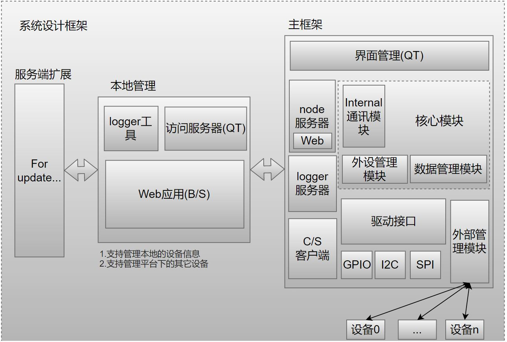

# 基于嵌入式Linux的局域网和云平台管理应用

## 项目框架



## 如何编译执行项目
### 第一步:将项目下载到指定的目录

1. 在wsl中编译该项目，下载或者解压到window下d:/user_project/git/中.<br/>
2. 在linux中编译该项目，下载或者解压到/home/center/application/git/中.<br/>
3. 使用自定义目录，需要修改文件**environment/.bashrc**, 将ENV_PATH_ROOT的值[usr_dir]替换成实际下载目录.<br/>

```bash
#environment/.bashrc line 18, 
export ENV_PATH_ROOT="[usr_dir]"
if [ ! -d "$ENV_PATH_ROOT" ]; then 
    export ENV_PATH_ROOT="/home/center/application/git/remote_manage/"
    if [ ! -d "$ENV_PATH_ROOT" ]; then 
        export ENV_PATH_ROOT="/mnt/d/user_project/git/remote_manage"
    fi
fi
```

###  第二步:将bashrc导入到系统目录
将environment/.bashrc复制到系统根目录, 如我的用户名为freedom, 执行命令如下，此处利用linux非root权限启动时会自动执行根目录下的.bashrc, 来加载编译环境和命令.<br/>
```bash
cp environment/.bashrc /home/freedom/
```
在linux环境执行linuxCtrl+ALT+T, WSL环境下输入bash，打开新窗口，如果显示如下，表示脚本加载成功.<br/>
```bash
Loading CDE Plugin...
-------------------------------------------------------------------------
Load Plugin Success!
Update the Plugin by filepath /home/[root]/.bashrc.
Root Path:/mnt/d/user_project/git/remote_manage
Load the Env Data...
Update Environment Data Success!
Can use command 'SysHelpCommand' for more helps.
Current Platform is Embed-Linux, Remote IPAdress is 192.168.1.24.
Current Firmware Version is 1.0.0.7.
Update the Alias Command...
Update the Alias Command Success!
-------------------------------------------------------------------------
```

### 第三步:使用命令进行编译和上传firmware
```bash
SysBulidApplication
SysPushFirmware
```
即可完成项目的编译和上传的支持ssh的远端服务器平台，另外可通过SysHelpCommand查询支持的命令, 另外本项目的应用也可以在Linux平台执行，因此通过命令**SysSetPlatformEmbedLinux**和**SysSetPlatformLinux**实现编译平台的切换，目前支持命令如下所示.<br/>
```bash
SysBuildApplication
    Build Application, Package Firmware.
SysBuildKernal
    Build the Kernal, if exist kernal directory.
SysSetPlatformEmbedLinux
    Set Current Platform to Embed-Linux Complier.
SysSetPlatformLinux
    Set Current Platform to Linux Complier.
SysSetRemoteIpAddress
    example:SysSetRemoteIpAddress 192.168.0.1.
    Set the remote ipaddress for command <SysPushApplication>
SysSetApplicationVer
    example:SysSetRemoteIpAddress 1.0.0.1.
    Set the verison of the firmware when build
SysBuildApplication
    Build the application, copy to nfs directory, also can push to embed-linux device.
SysPushApplication
    Push firmware to remote embed-linux device.
SysCleanApplication
    Clean the app firmware for next.
SysBuildKernal
    Build the linux kernal, copy to tftp directory, if failed, execute SysCleanKernal first.
SysCleanKernal
    Clean the kernal compiler data for next.
SysBuildUboot
    Build the uboot, copy to tftp directory, if failed, execute SysCleanUboot first.
SysCleanUboot
    Clean the uboot compiler data for next.
SysBuildRootfs
    build the rootfs, copy to nfs directory, if failed, execut SysCleanRootfs first.
SysCleanRootfs
    Clean the rootfs compiler data for next.
SysPackageFirmware
    Package the uboot, kernal, rootfs and application, can use tools download.
SysHelpCommand
    Show the help command.
```
如果编译报错，可参考**document/构建Linux编译环境.md**目录下说明.<br/>
1. 上述命令支持需要在指定的目录里仿真对应的文件，如果不存在会打印对应的目录，需要将对应的文件放置在指定目录中。<br/>
2. 如果编译失败，大概率是g++版本过低，更新arm-linux-gnueabihf-g++版本，目前测试通过使用的是7.5.0版本.<br/>
3. 在编译完成后，通过ssh将打包后文件传送到嵌入式平台，并上传到/tmp目录下，执行SysPushFirmware命令即可实现Code更新.<br/>
4. 嵌入式linux平台需要支持node服务器，可参考server/README.md构建，另外需要支持环回接口即127.0.0.1本地连接, 需要rcS文件添加如下端口.<br/>
```bash
ifconfig lo up
ifconfig lo netmask 255.255.255.0
```

## 项目结构

Build/              编译文件的基础结构，后面编译文件依赖此结构<br/>
document/           设计文档资料说明<br/>
enviroment/         用于构建编译环境的脚本<br/>
kernal_mod/         内核驱动模块实现<br/>
lower_app/          嵌入式Linux设备应用实现<br/>
&emsp;&emsp;Executables     生成可执行文件目录<br/>
&emsp;&emsp;manage/         嵌入式数据管理进程(数据处理核心进程)<br/>
&emsp;&emsp;gui/            嵌入式图形界面开发<br/>
&emsp;&emsp;server/         web服务器和web网页<br/>
package/            生成应用的打包文件<br/>
support/            用于支持应用执行的lib库或者环境<br/>
package/            编译完成后的打包目录<br/>
upper_app/          PC客户端应用实现<br/>
&emsp;&emsp;manage_tool/         用于访问嵌入式设备的桌面客户端(暂定QT)<br/>
&emsp;&emsp;loger_tool/     用于支持logger打印的网络调试工具(C#)<br/>

## 设计文档

参考文档(见document目录下说明), 初步设计包含:<br/>

嵌入式Linux端设计<br/>

1. 嵌入式驱动设备的访问，包含字符型设备，I2C, SPI，串口等访问，包含设备树支持<br/>
2. 支持配置管理，允许通过文件管理设备启动状态(配置文件使用JSON格式)<br/>
3. 基于linux系统API的线程创建，管理，线程间通讯支持<br/>
4. 本地端的通讯处理(Serial, Socket)等，基于自定义协议进行通讯(特殊指令的安全机制)<br/>
5. 内部状态读取更新显示，远端和本地的设置修改<br/>
6. 支持本地和网络的logger打印接口(基于asio设计)，调试等级显示可调<br/>
7. 访问外部设备的模块接口(基于CAN或者串口的轮询控制接口)<br/>

PC应用端设计<br/>

1. 访问Linux端接口，获取内部数据<br/>
2. 操作Linux端设备外设<br/>
3. 控制访问linux管理的远端信息<br/>
4. 其它功能组件<br/>

版本更新说明见demo/version_releas.md<br/>

## 硬件适配和兼容性

整个项目由上位机(windows平台和web平台), 主控设备(嵌入式linux平台)和其它设备平台(STM32单片机)组成.<br/>
1. 主控设备基于正点原子阿尔法开发板实现，使用imx6ull内核.<br/>
2. windows平台主要提供对于开发板的远程管理，基于QT设计，用于本地的软件访问和管理.<br/>
3. web平台基于vue开发，主要用于本地的web访问和管理.<br/>
4. 其它设备平台基于STM32单片机设计.<br/>

## 编译环境

嵌入式软件交叉编译工具<br/>
1. 内核模块使用编译工具 - arm-linux-gnueabihf-gcc<br/>
2. manage，gui编译工具 - arm-linux-gnueabihf-g++<br/>
3. server使用node作为运行环境<br/>
4. 网页使用vue方案<br/>

上位机编译工具<br/>
1. QT(the newest stable version)<br/>

logger显示工具<br/>
1. visual studio(the newest stable version)<br/>