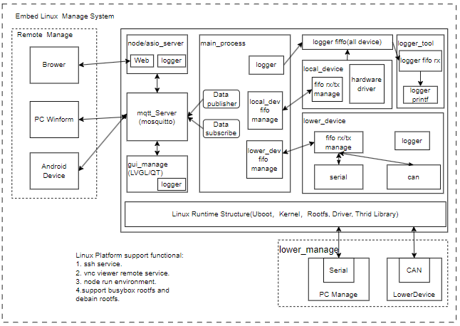

# 基于嵌入式Linux的管理平台应用

## 项目说明

本项目用于实现具有远程访问，权限控制，调试管理，本机硬件读取和设置，下位机管理的嵌入式Linux应用和驱动开发综合产品。内部实现平台构建，项目管理，内核驱动开发，应用开发等部分，项目支持在arm和aarch64平台，并提供相应的构建工具和编译平台，本项目已经验证的芯片平台。

- ARM平台: NXP I.MX6ull, 正点原子阿尔法开发板.
- AARCH64平台: 全志H616, WalnutPi.

- 项目地址: <https://github.com/zc110747/remote_manage.git>
- 配合学习的文档: <https://github.com/zc110747/build_embed_linux_system.git>

产品的目录如下所示：

- build             Makefile编译脚本。
- buildout          嵌入式端编译文件输出目录。
- desktop           桌面端访问应用
- doc               系统文档资料
- embed             嵌入式Linux应用
- env               用于构建环境的脚本
- mod               嵌入式Linux驱动和设备树
- platform          平台化文件，安装官方平台后导入
- rootfs            对于busybox支持的启动文件(buildroot和debain不需要)
- thirdparts        支持应用编译的第三方库。

## 项目框架



## 快速启动项目

下载项目后到本地后，执行预处理脚本构建完整的应用平台。

```shell
#download the program
git clone https://github.com/zc110747/remote_manage.git

#enter the directory
cd remote_mange/

#prepare for the environment
#此命令会安装必要的库，并在项目sdk/目录下构建系统开发环境
sudo chmod 777 *.sh
./preBuildEnvironment.sh all
```

关于sdk(arm/aarch64)目录内容的说明如下所示。

```shell
download                    #下载文件的目录
    - tmp                   #缓存空间
arm/arch
    build                       #保存编译好的平台
        - nfs_root              #nfs加载的目录
        - tftp_root             #tftp加载的目录
    img                         #打包文件系统目录
    install                     #交叉编译安装库目录
    support                     #系统运行需要的支持环境，编译器，uboot，kernel        
        - compiler
        - kernel
        - uboot
        - rs_buildroot
        - rs_debain
        - rs_ubuntu
```

重新开启命令行，如果加载如下所示，表示已经成功安装，项目需要在普通用户模式下执行，root权限无法加载。

```shell

Loading CDE Plugin...
-------------------------------------------------------------------------
Load Plugin Success!
Update the Plugin by filepath /home/[root]/.bashrc.
Root Path:/usr/application/coding_git/remote_manage
Load the Env Data...
Update Environment Data Success!
Can use command 'SysHelpCommand' for more helps.
Current Platform is ARM.
Current ROOTFS is debain.
Current Firmware Version is 1.0.0.8.
Update the Alias Command...
Update the Alias Command Success!
-------------------------------------------------------------------------
```

如果出现了上述打印信息，表示编译环境加载完成，此时执行如下命令安装系统运行需要的库。

```shell
#根据系统配置挂载文件系统
SysMoutRoots

#安装Debian系统和编译需要的第三方库
SysPreThirdParts
```

上述命令会从对应软件官网下载指定的文件，国内可能访问较慢，可以将文件复制到"[$(pwd)]/../sdk/download"中直接解压编译安装，对应文件包含如下:

- openssl <https://www.openssl.org/source/openssl-3.1.4.tar.gz>
- zlib <http://www.zlib.net/zlib-1.3.tar.gz>
- mosquitto <https://mosquitto.org/files/source/mosquitto-2.0.18.tar.gz>

此外还有一些库使用国内镜像库或者保存在本项目中，可以不直接下载，下面可以进行应用的编译。

```shell
#编译当前的所有应用
SysBulidApplication
```

另外可通过SysHelpCommand查询支持的命令, SysSetPlatformEmbedLinux和SysSetPlatformLinux切换编译不同平台的应用文件，目前支持命令如下所示.

```shell
SysPreThirdParts
    pull all thirdparts, install library and debain rootfs.
SysSetPlatformARM
    Set Current Platform to ARM Complier(NXP I.MX6ull).
SysSetPlatformAARCH64
    Set Current Platform to AARCH64 Complier(全志 H616).
SysSetApplicationVer
    example:SysSetApplicationVer 1.0.0.1.
    Set the verison of the firmware when build
SysBuildApplication
    Build Application, Package Firmware.
SysCleanApplication
    Clean the app firmware for next.
SysBuildKernel
    Build the linux kernal, copy to tftp directory, if failed, execute SysCleanKernel first.
SysCleanKernel
    Clean the kernal compiler data for next.
SysBuildUboot
    Build the uboot, copy to tftp directory, if failed, execute SysCleanUboot first.
SysCleanUboot
    Clean the uboot compiler data for next.
SysBuildRootfs
    build the rootfs, copy to nfs directory, if failed, execut SysCleanRootfs first.
SysCleanRootfs
    Clean the rootfs compiler data for next.
SysPackageFirmware
    Package the uboot, kernal, rootfs and application, can use tools download.
SysHelpCommand
    Show the help command.
```

## 编译环境

对于编译环境，主要包含虚拟机环境，Linux系统，软件源，交叉编译工具这些基础设施。

对于虚拟机环境使用过VMware, VirtualBox和WSL，其中VMware和Virtualbox使用体验都差不多，需要依赖跨系统复制，ssh或samba来回进行切换，不过在Linux平台使用vscode开发已经大大加快了开发效率。WSL则直接可以访问Windows平台程序，不过wsl1因为是模拟Linux接口，所以有很多Linux组件不支持，所以一定不要使用wsl1做交叉编译的环境，对于wsl2,也要确定是在Hyper-V环境下运行，可以综合两部分的优点。

Linux则建议使用满足条件下的最新LTS版本(本项目基于**Ubuntu 22.04.3 LTS**环境开发调试)，包含脚本加载，库编译，代码和驱动编译都进行了验证。旧版本Linux可能因为库或者软件版本问题，导致编译链接时失败。另外不要手动去替换libc/licxx这类，因为有可能导致系统命令链接失败，这种情况基本只能重装，虽然现在基本都一键式傻瓜安装，不过时间还是要花费的。如果硬盘足够大，建议第一次完整构建好环境后，将虚拟机系统进行备份，这样即使操作失误导致系统损坏，删除损坏的系统，重新恢复下原虚拟机系统即可。

对于Linux，你使用的所有工具都在apt-get覆盖的程序库内，将会很简单。不过当你自己编译某个工具，就比较复杂了, 这里以编译mosquitto举个例子，首先需要openssl和Cjson的支持，而编译openssl需要perl新版本的支持，也就是需要4个软件的安装才能完成最后的编译，还需要将动态库放置在指定位置系统才能正常工作。不同的Linux版本，编译器以及库安装情况，导致编译时面对的错误都会不一致。这是Linux系统的不统一导致的，目前没有好的办法，使用相同的系统，通过脚本进行统一构建，并保持更新，只能算相对较统一的方法。

交叉编译工具主要用于编译uboot，kernal，文件系统，应用和库，uboot和kernal如果使用较早版本则有限制，使用新的编译器会包含删除的功能，导致无法编译通过，用老的编译工具即可，文件系统和应用，库需要用一个编译器版本，它们的执行依赖文件系统中的lib库，版本不匹配可能会导致接口缺少而无法正常工作。本项目开发使用的环境如下：

```shell
虚拟机 - VMvare/WSL2
Linux系统 - Ubuntu 22.04 LTS
软件源 - 清华镜像源(https://mirrors.tuna.tsinghua.edu.cn/help/ubuntu/)

#ARM
交叉编译工具 - gcc-arm-11.2-2022.02-x86_64-arm-none-linux-gnueabihf
u-boot: uboot-imx-lf_v2022.04(https://codeload.github.com/nxp-imx/uboot-imx/zip/refs/heads/lf_v2022.04)
kernel: linux-imx-lf-6.1.y(https://codeload.github.com/nxp-imx/linux-imx/zip/refs/heads/lf-6.1.y)
rootfs: buildroot-2023.02.9(https://buildroot.org/downloads/buildroot-2023.02.9.tar.gz), debain11(http://mirrors.tuna.tsinghua.edu.cn/debian/dists/bookworm)

#AARCH64
交叉编译(kernal/uboot/rootfs/application/lib) - gcc-linaro-4.9.4-2017.01-x86_64_arm-linux-gnueabihf 
```

## 设计文档

参考文档(见document目录下说明), 初步设计包含如下。

嵌入式Linux端设计

1. 嵌入式驱动设备的访问，包含字符型设备，I2C, SPI，串口等访问，包含设备树支持
2. 支持配置管理，允许通过文件管理设备启动状态(配置文件使用JSON格式)
3. 基于linux系统API的线程创建，管理，线程间通讯支持
4. 本地端的通讯处理(Serial, Socket)等，基于自定义协议进行通讯(特殊指令的安全机制)
5. 内部状态读取更新显示，远端和本地的设置修改
6. 支持本地和网络的logger打印接口(基于asio设计)，调试等级显示可调
7. 访问外部设备的模块接口(基于CAN或者串口的轮询控制接口)

PC应用端设计

1. 访问Linux端接口，获取内部数据
2. 操作Linux端设备外设
3. 控制访问linux管理的远端信息
4. 其它功能组件

## 硬件适配和兼容性

整个项目由上位机(windows平台和web平台), 主控设备(嵌入式linux平台)和其它设备平台(STM32单片机)组成.

- 主控设备提供数据管理，logger打印，mqtt服务以及本地和远程设备管理功能。
- windows平台主要提供对于开发板的远程管理，基于QT设计，用于本地的软件访问和管理.
- web平台基于vue开发，主要用于本地的web访问和管理.
- 其它设备平台基于STM32单片机设计.
